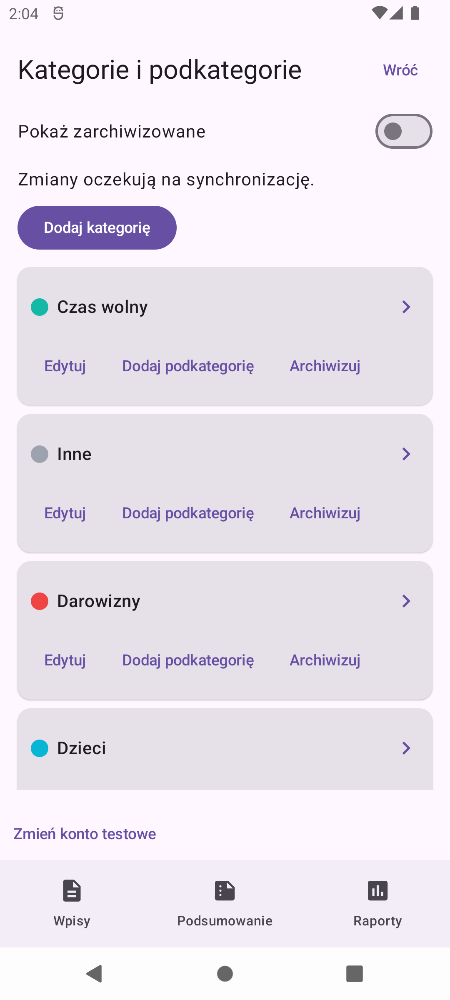
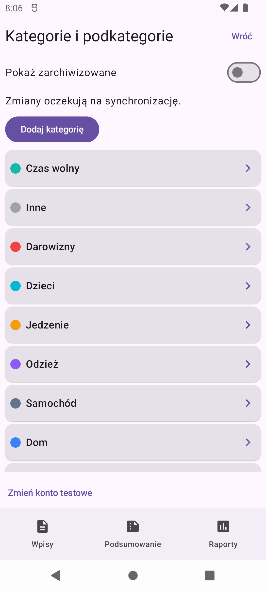
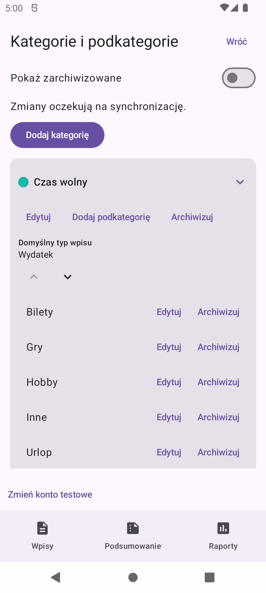
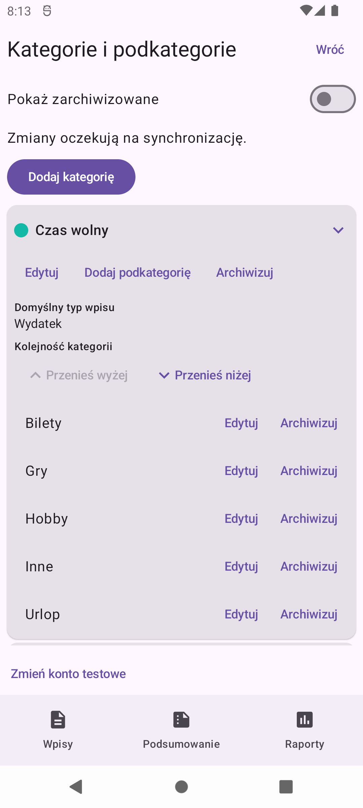
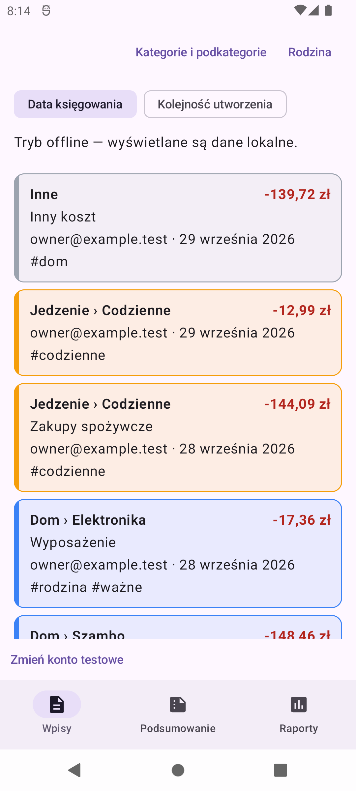

# Issue #52 — category screen usability

These screenshots were captured from Thesaurus DEV on the same API 31 emulator
at 1080 × 2400 pixels, using the existing local test household and category order.
The before screenshots show `master` before this change (`8d6f8e2`).

## Collapsed categories

Before, three complete cards fit in the list viewport. After the change, eight
complete cards fit. Editing and archive actions are available after expanding
the relevant category. Collapsed headers retain a minimum 48 dp touch target.

## Expanded category and reorder controls

The first category has its upward move disabled. The visible **Kolejność
kategorii** heading and labeled buttons identify the category-level actions.
TalkBack descriptions also include the category name and movement direction.
Subcategories remain in their existing alphabetical order within their parent.

## Bottom navigation

This screenshot was taken after tapping **Wpisy** in the bottom navigation from
the expanded category screen. The entries list is visible and **Wpisy** is
selected. Instrumentation tests separately verify that settings does not return
after switching tabs and that no previous screen remains in the entries stack.

## Automated layout coverage

The category instrumentation suite also checks a 280 dp viewport with 1.6× font
scale and 1.15× display density, long category/subcategory names, action containment,
minimum touch-target heights, disabled list boundaries, and full-card dragging.
