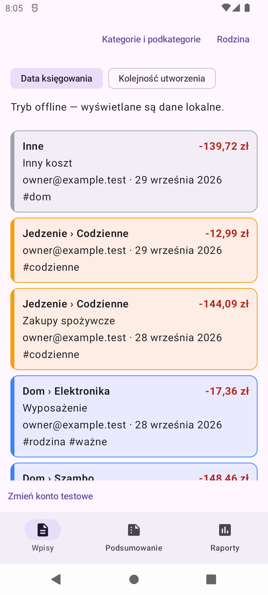
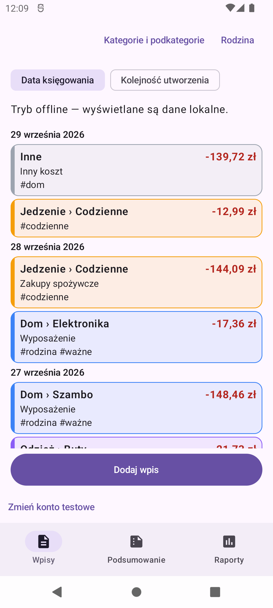
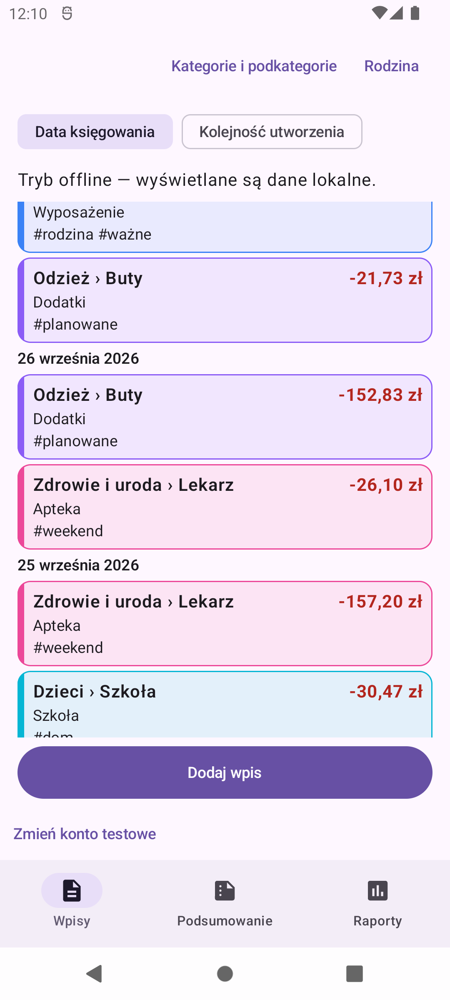
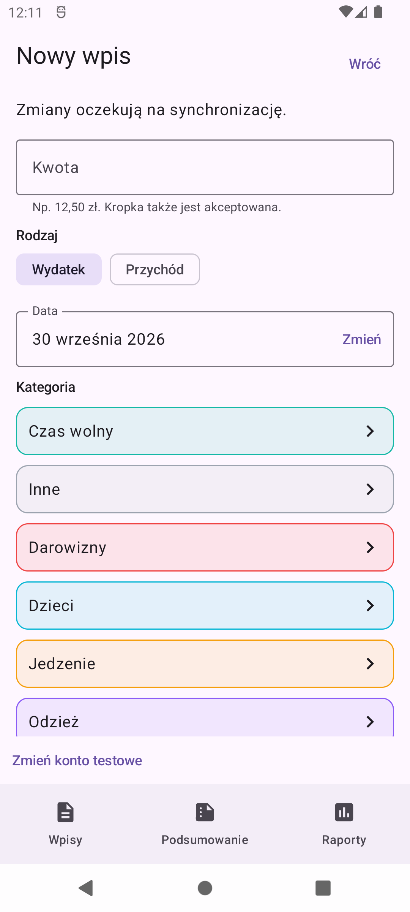

# Issue #53 — compact entry cards and accounting-date headings

Visual evidence uses Thesaurus DEV with the same cached, synthetic household on
the API 31 emulator: 1080 × 2400 pixels, 420 dpi, default font scale. No real
Google account or production data is used. The offline banner is expected because
the local Firebase emulators are not running during these captures.

The baseline was captured before this change. The installed build used for that
capture included issue #52, which did not modify the entries screen; its entry
layout matches the `master` base of this branch (`8d6f8e2`).

## Before

Each card repeats creator e-mail and accounting date. The add action is a scrolling
list item and is not visible at the top of this populated list.

## After

Creator e-mail and per-card dates are removed only from presentation. Separate
Polish accounting-date headings mark consecutive date runs without changing the
selected sort order. The add action is fixed above bottom navigation.

With this unchanged data set, five complete cards and part of a sixth now fit,
compared with four complete cards and part of a fifth before. Taxonomy and amount
retain their original emphasis; secondary text is 14 sp and scales with the user's
font setting. Card and add-action touch targets remain at least 48 dp.

## Add action while browsing

The footer remains in the same location after scrolling. Tapping it opens the
new-entry form; the form was then dismissed without saving or changing the test data.

## Automated coverage

- JVM tests check consecutive and interleaved dates, calendar boundaries, pagination,
  filtering/refresh/add/edit/delete projections, unique row keys, and unchanged author metadata.
- Compose tests check date-heading recomposition, fixed add action while scrolling
  and loading another page, loading/empty/error states, category colors, edit/delete
  and undo, minimum 48 dp card/action heights, and long text at enlarged font/density.
- Navigation tests render the real household scaffold with enlarged font/density
  and an additional 32 dp bottom system inset. They check add-action containment
  above navigation and successful navigation after scrolling.
