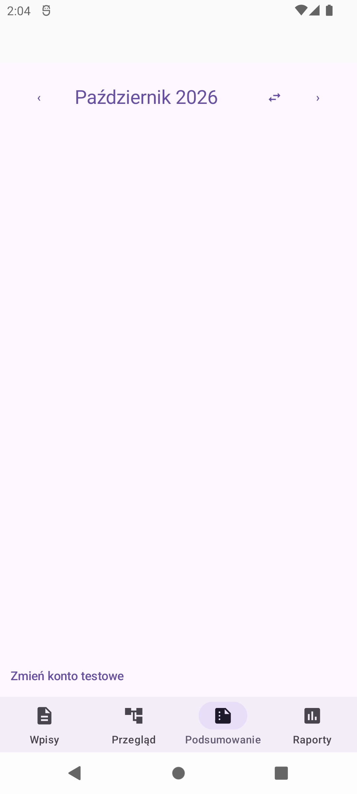
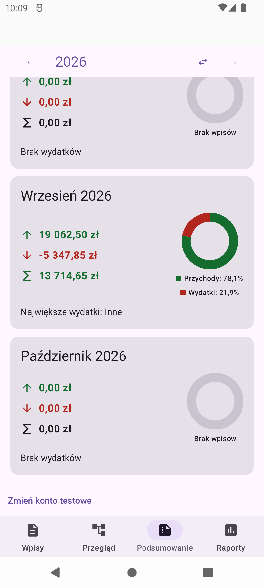
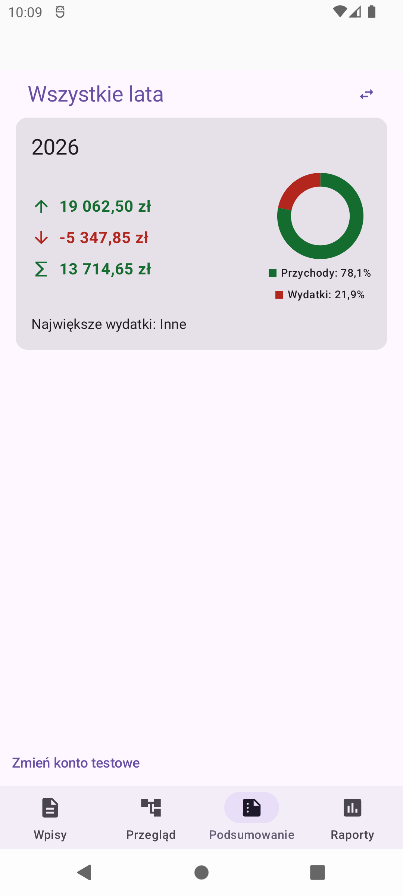
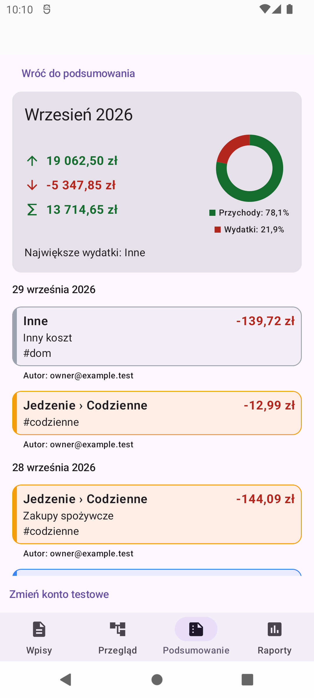
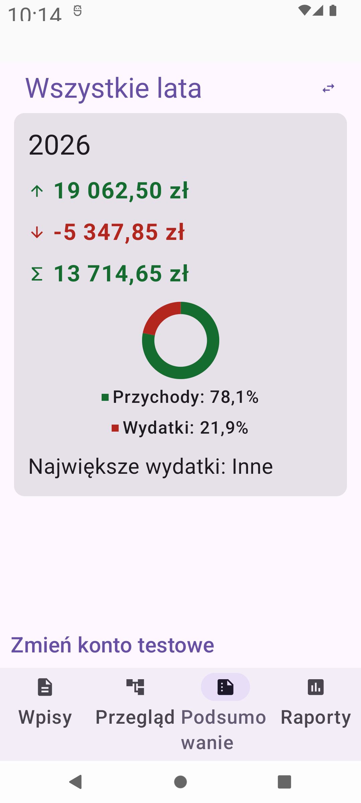
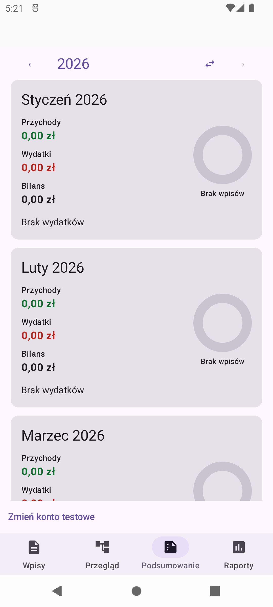
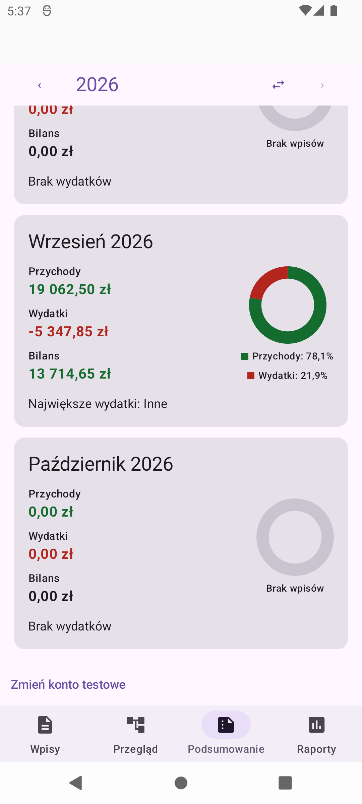
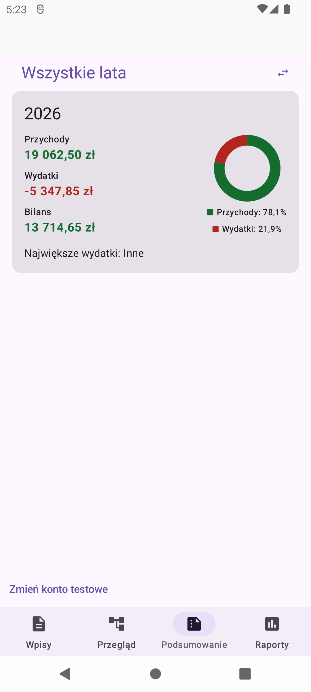
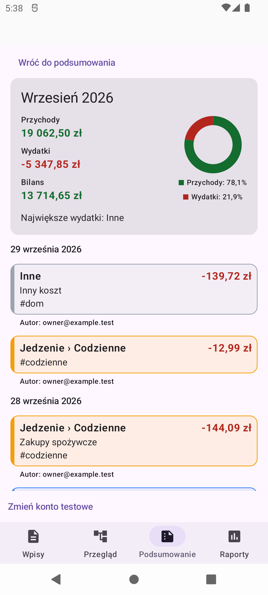
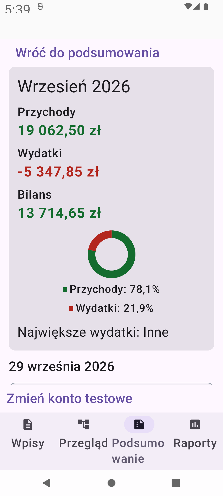

# Issue #67 — monthly and yearly Summary cards

All PNGs are unmodified captures of the running `devDebug` APK on the
`thesaurus_api31` Android 12 / API 31 emulator (1080 × 2400, density 420).
Only the existing synthetic developer household was used; no real sign-in or
production Firebase data was accessed. The existing entries were preserved.

## Before

## Review update — compact metric symbols

Income, expense and balance captions have been replaced with aligned `↑`, `↓`
and `∑` symbols beside the exact amounts. Polish metric names remain available
to screen readers, including the non-clickable detail header. Chart legends
retain their labels so their colours are not the only way to identify them.

## Original implementation

## Manual walkthrough

1. Update the developer APK without clearing app storage and open `Podsumowanie`.
   The current year is selected; month cards are chronological. Empty months
   have zero totals, a neutral ring, and `Brak wydatków`.
2. Tap the year heading. `Wszystkie lata` contains the populated 2026 card,
   with green income, negative red expense, signed balance, labelled chart,
   and `Największe wydatki: Inne`.
3. Tap the heading again. The previously selected monthly year is retained.
   Slowly scroll to September. Its amounts and chart match the yearly card
   because this household's existing data is all in September.
4. Tap September. The detail header retains exactly the same totals, and the
   dated entries retain category colours, optional titles/tags, and author labels.
5. Set emulator text size to 180%. The card stacks its chart below the amounts
   without text/chart overlap. Restore the original text size after inspection.

Captured amounts: income `19 062,50 zł`, expense `-5 347,85 zł`, balance
`13 714,65 zł`; chart shares 78.1% / 21.9%. The source household is test-only.

Automated verification results are reported in the PR description. Tests also
cover multi-year data, leap-year/calendar boundaries, future/deleted/foreign
entries, tied categories, exact large totals, zero/single-type charts, saved
state, permission metadata, scroll restoration, and real emulator offline writes.
