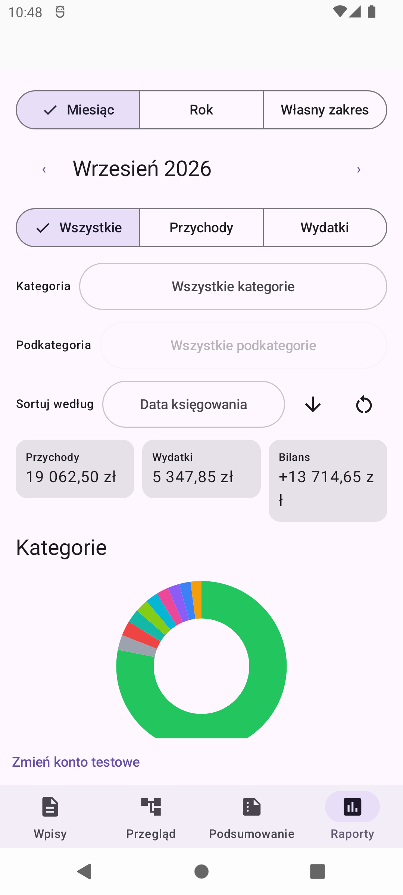
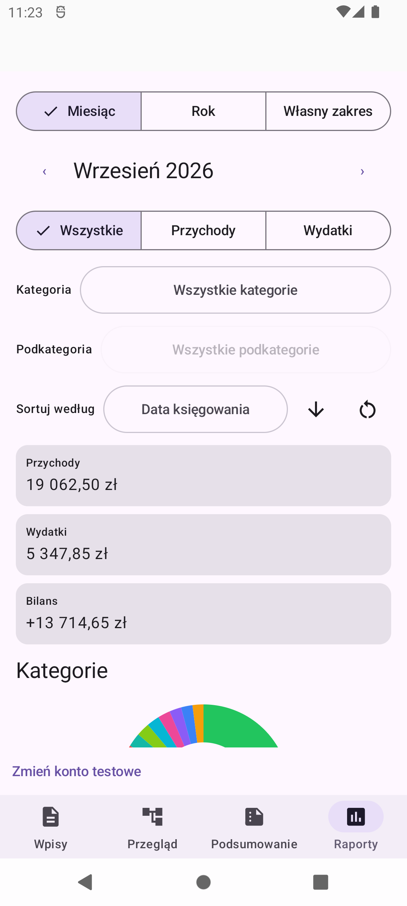
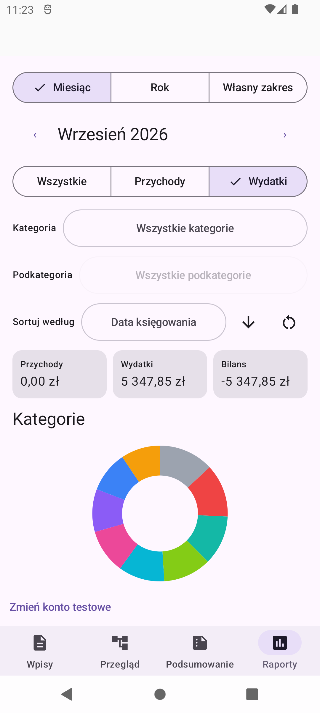
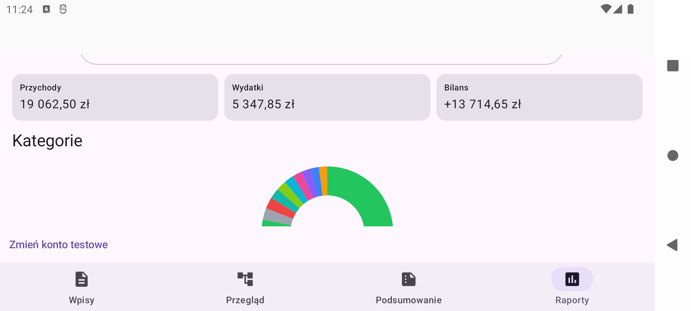
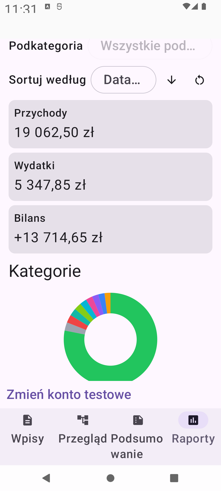

# Issue #71 — complete report amounts on one line

These are unmodified screenshots from the developer APK using the existing
synthetic household. No real Google sign-in or production data was used, and
the emulator's existing entries were preserved.

## Before

On the API 31 phone emulator (1080 × 2400, density 420), the positive balance
`+13 714,65 zł` splits the currency suffix: `ł` is stranded on the second line.

## After

## Behaviour

The cards retain the exact Polish formatting, existing signs and original font
size. They share three columns only when their measured labels and amounts fit
inside every card. Otherwise, they become full-width stacked cards. No amount
is abbreviated or ellipsized, and its currency is never broken onto a new line.

Only exceptional sums wider than a complete card use horizontal scrolling at
the unchanged readable font size, with a visible Polish instruction. TalkBack
retains the metric name and complete value even in that exceptional case.

## Verification walkthrough

1. Open `Raporty`, select `Miesiąc`, `Wrzesień 2026`, `Wszystkie` and no category
   filters. Income is `19 062,50 zł`, expense `5 347,85 zł`, balance
   `+13 714,65 zł`; each amount including `zł` is on one line.
2. Select `Wydatki`: income becomes zero and the balance is `-5 347,85 zł`.
   The negative sign and complete currency stay with the amount.
3. Restore `Wszystkie`, rotate to landscape and scroll to the totals. The wider
   screen allows three columns when all measured content fits.
4. Restore portrait, set text size to 180% and restart the developer app if
   necessary to apply the setting. Scroll to the totals; the exact values remain
   readable at the larger font size.
5. Restore portrait, text size 100% and `Wszystkie` after verification.

Automated tests cover all three cards, positive/negative balances, realistic
large grouped amounts, 280/320 dp portrait widths, a verified 720 dp landscape
viewport, font sizes 180%/200%, display-density changes, resizing, exact pixel
fit boundaries, full Reports-screen aggregation wiring and exceptional
arbitrary-precision scrolling. PR verification records the actual test results.
