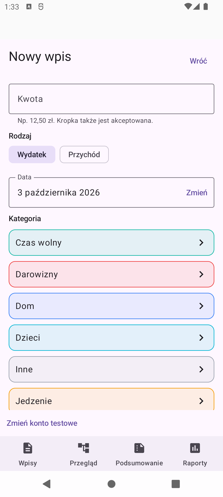
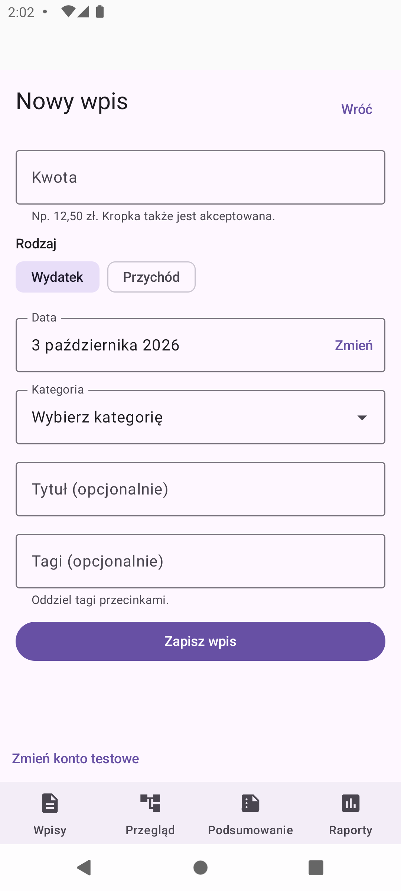
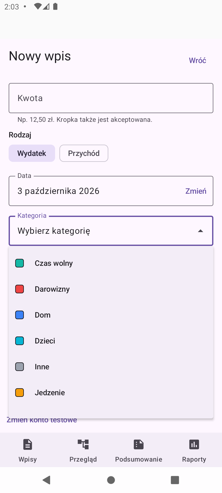
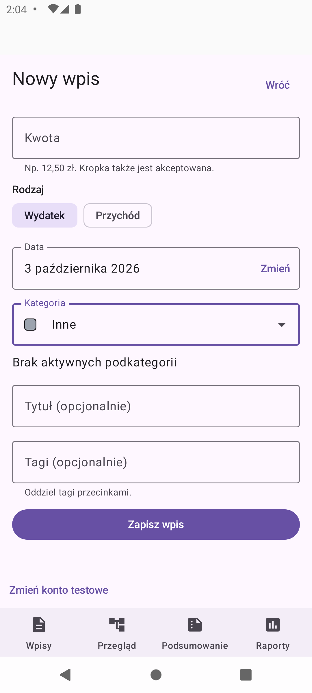
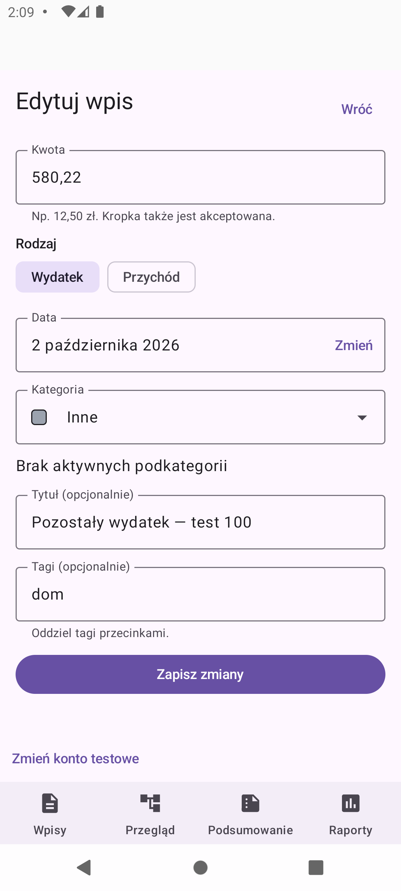
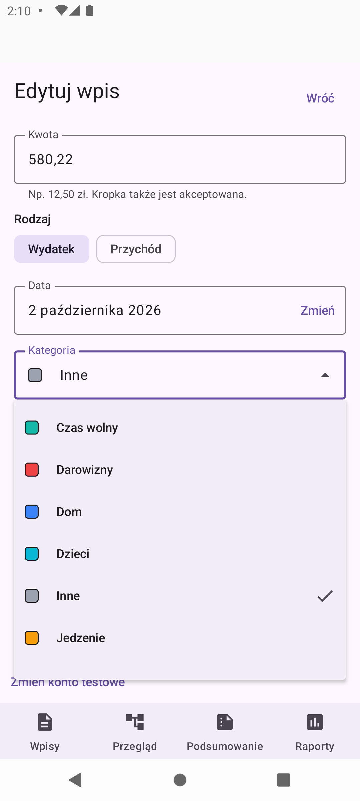

# Issue #78 — category dropdown in entry forms

These are unedited screenshots of the Android API 31 emulator, captured with
`android screen capture`. The device uses its native 1080 × 2400 resolution,
420 dpi density and normal font scale. The DEV build connects only to local
Firebase emulators. All names, amounts, tags and entries shown are synthetic.

## Before and after

| Before: category cards | After: collapsed category field |
| --- | --- |
|  |  |

The old form is from master at `551323466b7b2e6c4f40fc6d89558bd62d6f22b8`.
The new form uses one category field, leaving the optional title, tags and save
button visible without scrolling on this device.

## Adding an entry

Tapping the category field opens the anchored, height-bounded dropdown. Existing
household ordering and category colour indicators are preserved. Additional
categories are available by scrolling inside the menu.

Selecting `Inne` closes the menu and updates the field. This category has no
initial subcategories. The manual demonstration did not submit a new entry.

## Editing an existing entry

The persisted synthetic entry is loaded with its amount, date, direction,
category, optional title and tags intact.

Opening the same dropdown in edit mode shows a check next to the current
category. No edit was saved while capturing these screenshots.

## Automated checks complementing the screenshots

- JVM coverage checks defaults and manual direction overrides, subcategory
  clearing, invalid options, all draft fields restored through `SavedStateHandle`,
  route isolation and stable IDs when retrying a restored pending save.
- Compose coverage checks full-field activation, selection, Back/outside-tap
  dismissal, selected and expanded/collapsed semantics, hardware keyboard
  navigation and focus return, archived/empty options and transient-popup restore.
- A 24-category fixture checks scrolling and complete long-name layout in a
  320 dp form with 1.6× font scaling; the screen suite also ran on a 320 × 640,
  160 dpi emulator override, which was subsequently reset.
- An authenticated local-Firebase integration test checks cached category
  ordering, offline signed persistence, synchronization and restored editing.

All active categories remain available for both income and expense. Direction
defaults are not restrictions; this follows the user's clarification of #78.
Accessibility semantics and keyboard interaction are automated checks, not a
claim that a manual spoken TalkBack session was performed.
