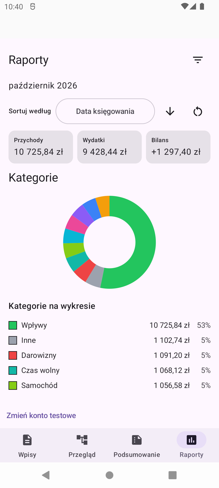
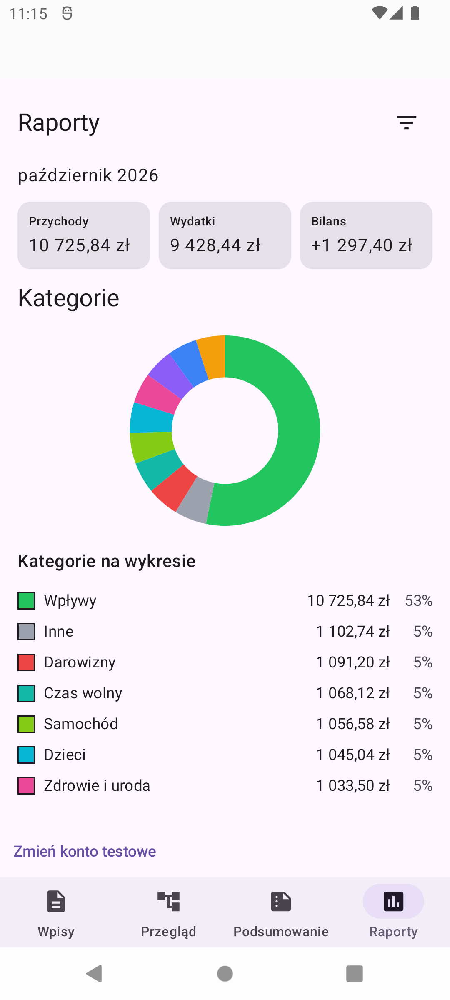
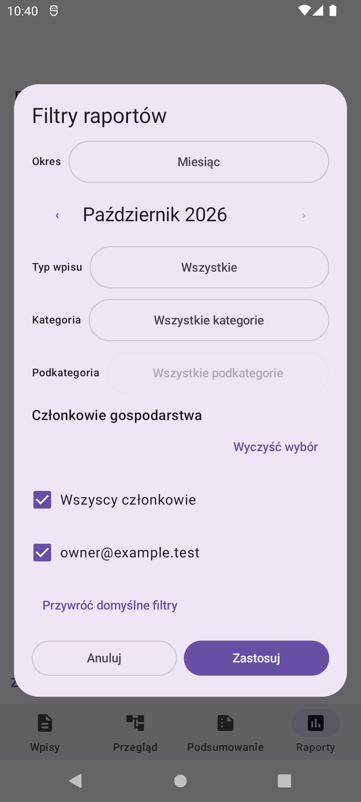
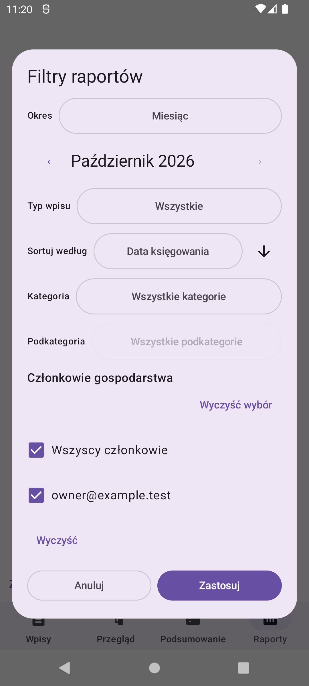
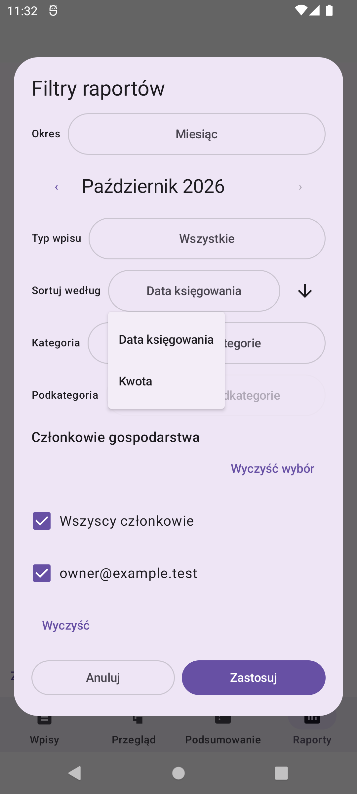
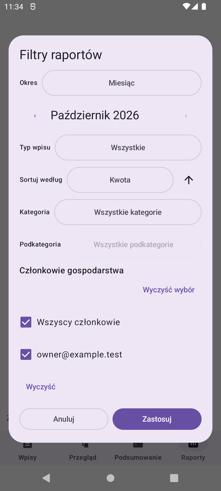

# Issue #79 — sorting inside the report filter dialog

Unedited screenshots captured with `android screen capture` on the API 31
emulator at native 1080 × 2400 / 420 dpi / normal font scale. The DEV application
uses local Firebase emulators and synthetic data only. The existing 100 sample
entries were not added to, edited or deleted during this verification.

The before build corresponds to master at
`ff0878cd43917040c614219df56f17afa5bc6061` (merged #78).

## Main report: before and after

| Before | After |
| --- | --- |
|  |  |

The main screen no longer has the sort field, direction arrow or separate sort
reset. The funnel is the only configuration entry point. The same October
income, expense, net, donut and legend remain visible, with more room for results.

## Filter dialog: before and after

| Before | After |
| --- | --- |
|  |  |

The field and direction arrow share one row. `Wyczyść` resets both filters and
sorting in the draft; `Zastosuj` is still required. The dialog content can scroll
while the action buttons remain reachable.

## Selecting and applying sorting

| Available fields | Draft: amount ascending |
| --- | --- |
|  |  |

Manual steps: open the funnel, open `Sortuj według`, choose `Kwota`, toggle the
direction arrow, then press `Zastosuj`. No taxonomy, type, period or member
selection was changed.

Only after applying does the funnel show the nondefault-configuration marker.
The same totals remain: income 10 725,84 zł, expense 9 428,44 zł and net +1 297,40 zł.
The visible category values and donut are unchanged by sorting.

## Automated verification

- 156 JVM tests passed, including all four date/amount directions, stable ties,
  unchanged entry membership and complete aggregation, draft/apply/cancel/reset,
  applied-state restoration and atomic offline filter/sort application.
- All 26 report UI/integration tests passed on API 31, including all eight dialog
  control tests and both isolated Firebase repository integration tests.
- Tests cover Back/outside dismissal, large-font 320 dp layouts, real keyboard
  dispatch, direction/funnel accessibility semantics, invalid custom dates and
  cached offline restoration. TalkBack coverage is semantic, not a manual spoken
  TalkBack session; saved-state restoration is tested using saved-state APIs.
- Lint has no errors and only the existing 32 warnings and one hint.

These screenshots show the normal phone configuration, not the enlarged-font
test fixtures. Full application regression, Firestore Rules and hosting checks
are also performed by GitHub CI for the PR.
