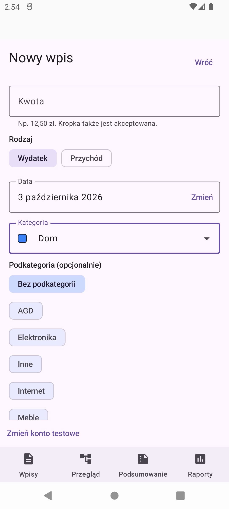
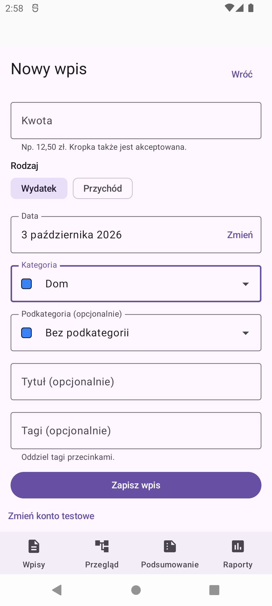
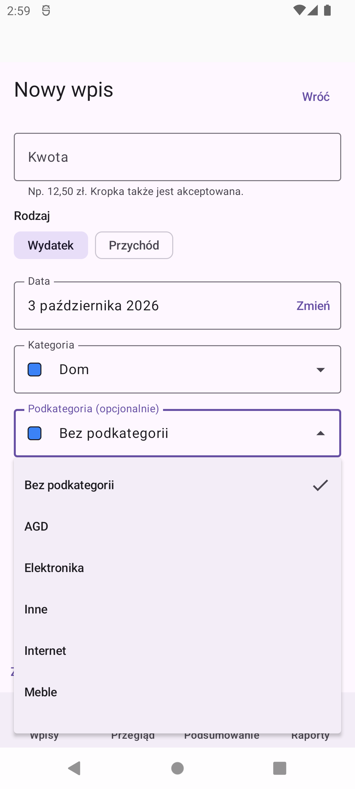
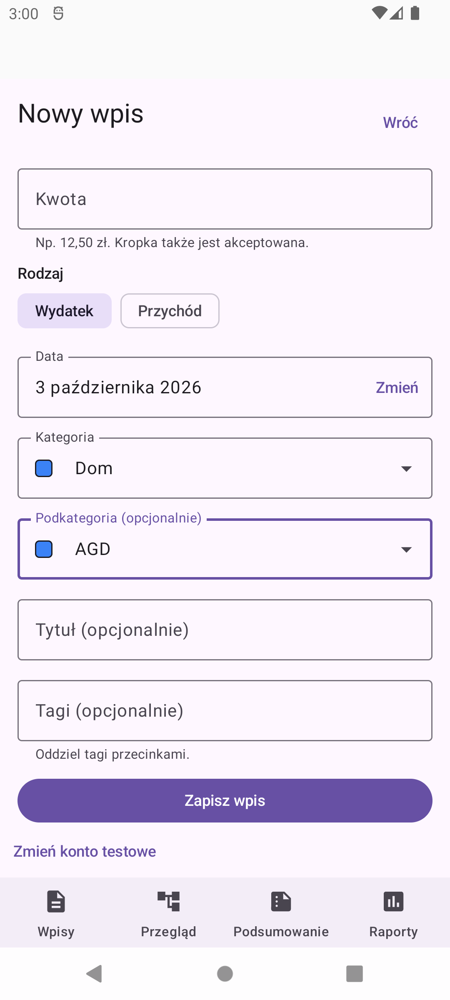
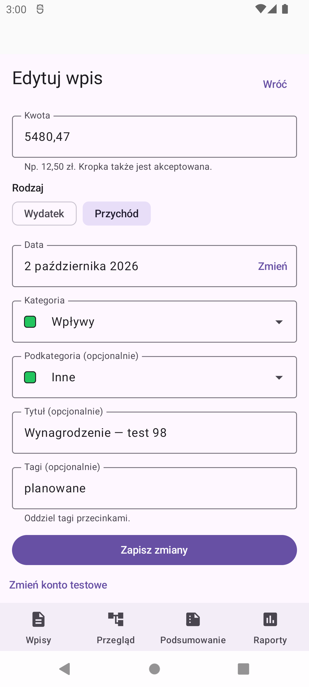
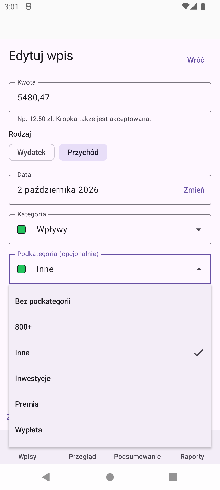

# Issue #86 — subcategory dropdown

Real, unedited API 31 DEV emulator screenshots using synthetic local Firebase data.
Captured at native 1080 × 2400, 420 dpi, normal font on `thesaurus_api31`.
No crop, overlays, image editing or production accounts/data were used.

## Before and after

The before image uses the merged category-dropdown implementation from #78.
The after images use the subcategory dropdown from #86.

| Before: add, Dom | After: add, Dom |
| --- | --- |
|  |  |

| Subcategory options | Selected subcategory |
| --- | --- |
|  |  |

| Editing an existing entry | Editing options |
| --- | --- |
|  |  |

## Reproduce

1. Use local Firebase Auth/Firestore emulators and `assembleDevDebug`.
2. Sign in with a synthetic DEV account and its existing test household.
3. Open **Wpisy → Dodaj wpis**, select **Dom** in the category menu.
4. Open **Podkategoria (opcjonalnie)**. Check that **Bez podkategorii** is selected,
   the menu is anchored to the field, and the long Dom option list is scrollable.
5. Choose **AGD**: the menu closes and the collapsed field displays AGD.
6. Leave without saving. Open the sample **Wynagrodzenie — test 98** entry.
   Check that its persisted **Wpływy / Inne** values are already displayed.
7. Open its subcategory menu and check the **Inne** checkmark. Dismiss with Back
   and return to the list without saving.

No entries were created, edited or deleted during this visual verification.
All 100 original sample entries remain (40 August, 40 September, 20 October 2026).
Animations were temporarily disabled for reproducible tests/captures and restored afterwards.

## Automated verification

- 157 JVM tests passed, including 20 form ViewModel tests.
- All 19 API 31 entry-form package tests passed (18 Compose screen tests plus one
  isolated real-Firebase repository integration test).
- Tests cover add/edit selection, explicit optional clearing, archived historical
  values, parent changes, direction overrides, selected/collapsed/expanded semantics,
  Back/outside dismissal, keyboard navigation and focus return, transient menu restoration,
  and persisted IDs during offline save and restored editing.
- Long names/lists are tested at a 320 dp Compose container width and 1.6 font scale,
  including text-layout assertions. The screenshots themselves use native/default settings.
- Accessibility verification is semantic and hardware-keyboard coverage, not a manual
  spoken TalkBack session. State restoration uses Compose/SavedStateHandle test APIs.
- Lint: no errors; 32 existing warnings and one hint. Debug, instrumentation and DEV APKs build.
- Full-repository CI results are recorded in the PR description; API 37 runs daily/manual only.
