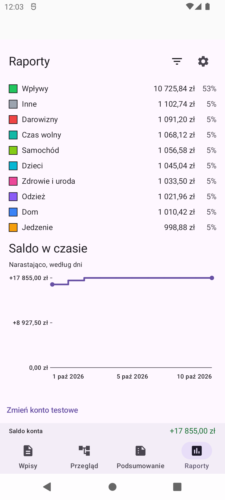
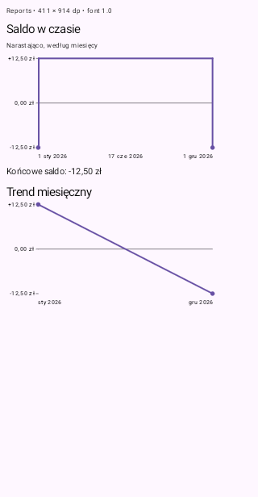
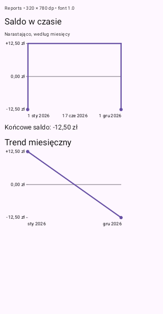
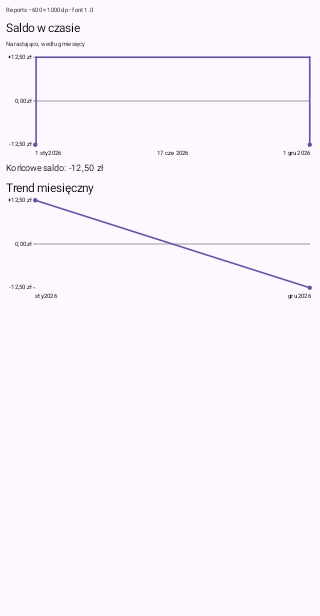
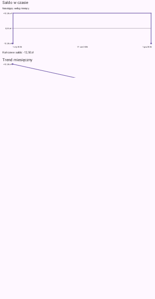
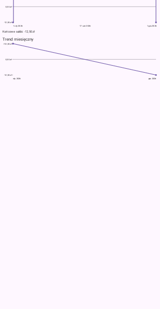
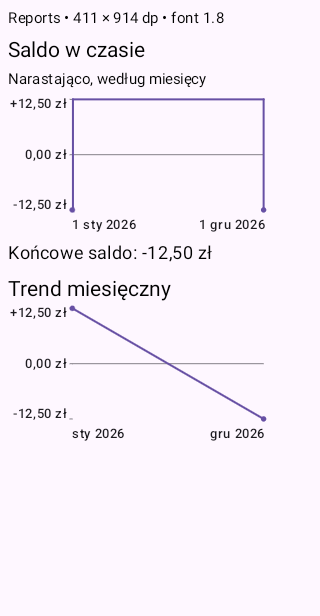
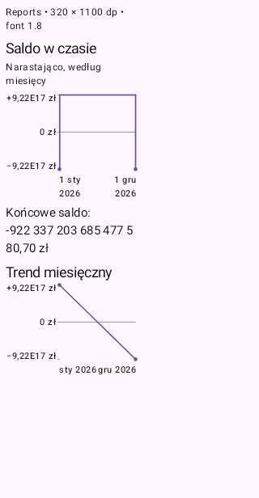

# Issue #105 visual evidence

Source: passing [API 31 CI run 37993631251](https://github.com/Bargor/thesaurus/actions/runs/37993631251), code commit `90dedb5acfdbe684f9a888c7490ab5f2e85a130c`. All 194 device tests passed, including six new chart-width scenarios. Lint/JVM, Rules/Hosting/watchdog, APK assembly and DEV test wiring also passed. The primary agent inspected all seven CI PNGs and the additional actual DEV emulator capture below.

CI images are unedited Compose-root captures of the actual `ReportsBalanceChart` and `TrendChart` components using synthetic amounts. Both span January 1 to December 1, 2026. Balance opens at −12.50 PLN, rises to +12.50 PLN and closes at −12.50 PLN; monthly results are +12.50 and −12.50 PLN. The large-value fixture scales the signed amounts to exercise compact axis formatting and wrapped exact values without changing financial semantics.

The physical CI root is 320 × 616 px. A test-only density maps each labelled logical viewport into that root, without changing the emulator's resolution or date. Wide/landscape labels therefore look physically smaller in these raw CI images; this is a logical responsive-layout check, not a claim of a native 840-pixel display. Landscape captures scroll the same paired fixture to show each intended chart section. Empty space outside the synthetic viewport belongs to the test root, not the chart's reserved Y-axis gutter.

Tests assert natural visible Y-tick width, shared plot/date coordinates, majority data width for ordinary amounts, full measured text without ellipses or overflow, exact signed descriptions, and painted labels/line endpoints. Antialias coverage checks reject blank surfaces and cross-color blends, retaining the required ink counts. Only paint-validated published frames are included here; pending diagnostic frames are not visual proof.

## Actual running DEV app

At the user's explicit request, built and installed the same code with `assembleDevDebug`, preserving the previously seeded 100 synthetic entries. This unedited native 1080 × 2400 px capture (420 dpi) shows the October balance chart in the complete app. No local tests were rerun and no real account or financial data was used.

## Current-device-equivalent portrait: 411 × 914 dp

## Narrow portrait: 320 × 780 dp

## Wide portrait: 600 × 1000 dp

## Landscape: 840 × 420 dp

Balance section, followed by the monthly-result section at its own scroll position:

## Enlarged font: scale 1.8 at 411 × 914 dp

## Large signed amounts: scale 1.8 at 320 × 1100 dp

Compact Y ticks retain PLN units; exact closing amounts and endpoint dates wrap rather than being omitted or ellipsized.

