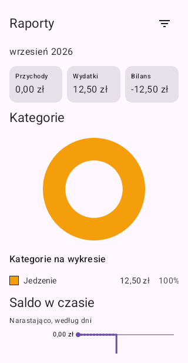

# Issue #96 visual evidence

Source: passing [API 31 CI run 37853227416](https://github.com/Bargor/thesaurus/actions/runs/37853227416), application commit `b2dd37e28a0a07bc9444a9b8a91d8adf77f0bc0b`.

`MalformedFinancialVisualEvidenceTest` drives the real Reports ViewModel and screen using synthetic repository observations, not a real Firebase account. The same UI receives a valid ledger, a typed malformed-data error, and corrected data. The test asserts totals/entries/chart absence while unavailable and their recovery afterward. It also verifies painted header and amount/error pixels in each captured bitmap, preventing blank frames from passing on semantics alone.

These are unedited Compose-root PixelCopy captures at the CI's 320 dp phone viewport (PNG 320 × 616 px, excluding the system status bar). Lower report content naturally scrolls below the viewport. No real credentials, account identifiers, or financial records are shown.

## Valid data

Income 0.00 PLN, expense 12.50 PLN, signed net −12.50 PLN; normal charts are visible.

## Malformed data: results unavailable

The neutral Polish error and retry action remain; totals, category chart, balance chart, and entries are absent, not presented as zero or stale results.

## Corrected data: observation recovers

The same ViewModel recovers without restart: expense 18.00 PLN and signed net −18.00 PLN are visible.

