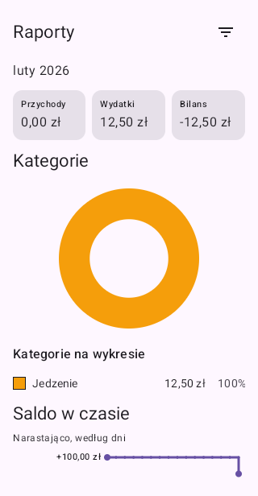
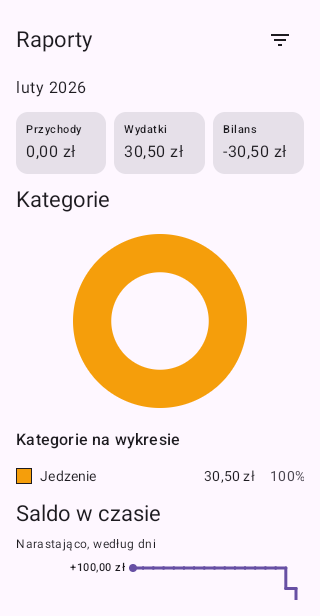
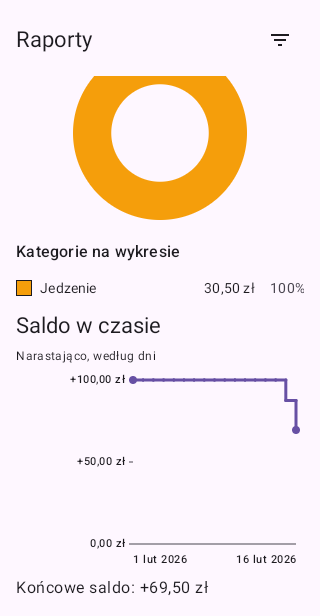
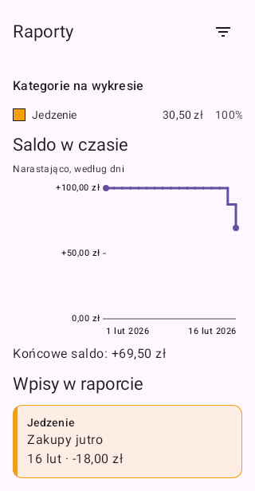

# Issue #97 visual evidence

Source: [API 31 CI run 37895382722](https://github.com/Bargor/thesaurus/actions/runs/37895382722), application commit `2ea29ac348f515031c2575839bd1b80e56ee8329`.

`ReportsDateLifecycleTest.foregroundMidnightUpdatesTotalsChartsAndListAndProducesPaintedEvidence` passed in this run. The full run was **not green**: a separate disposal-cancellation test failed because it observed clock reads before Compose completed disposal. Its synchronization is corrected separately; these images do not imply that the complete suite passed.

The passing visual test drives the real Reports route and retained ViewModel using synthetic repositories and an injected clock. It verifies the midnight timer, signed totals, category shares, trend, balance, list, absence of later future entries, and painted glyph pixels. The device's date and Firebase data are not changed.

These unedited Compose-root captures use the CI 320 dp phone viewport (PNG 320 × 616 px, excluding the status bar). The balance and entry captures scroll the same screen; they are not different report periods. The primary agent inspected all four images. No real account or financial records appear.

## Before midnight

February 15: expense 12.50 PLN, net −12.50 PLN. The February 16 entry is still excluded.

## After midnight

February 16: the same selected February report now includes the newly eligible entry without a repository emission. Expense 30.50 PLN, net −30.50 PLN; category shares update together.

## Refreshed balance chart

The end date is February 16 and closing balance is +69.50 PLN, including 100.00 PLN of January history and February expenses. History does not enter February's period totals.

## Newly eligible entry

The February 16 expense of 18.00 PLN is present. The later February 20 entry remains absent.

